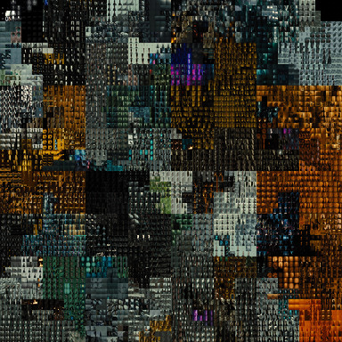
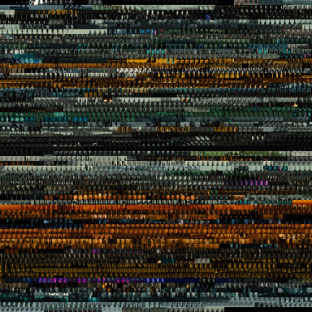
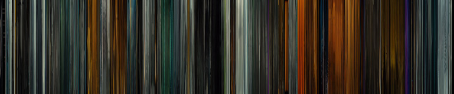

# Hilbert Montage
Generate montage for movies/videos following [hilbert](https://en.wikipedia.org/wiki/Hilbert_curve) curve.

Generates an images from the frames of the video/movie by mapping time (1D) to image (2D) based on Hilbert curve and showing associated frame at that point. Hilbert curve preserves relative distance with the neighboring frames when we map from 1 dimension to 2 dimension to some extent. Please see [3Blue1Brown](https://www.youtube.com/watch?v=3s7h2MHQtxc) for better explanation regarding Hilbert curves. Along with Hilbert montage image, it also generates _normal montage_ which follows arranges the frames from left to right and top to bottom. and _barcode_ pattern which just create barcode like pattern by compressing width of frames to 2 pixel.

### Dependency
* Elixir
* FFmpeg for extracting frames
* ImageMagick for generating image

### Run

``` shell
$ ./hilbert <path_to_video> <prefix>
```

will generate 3 images with the prefix `<prefix>` and suffix `_hilbert`, `_normal` and `_bar`.


### Example

Output for _Blade Runner 2049_

#### Hilbert Montage



#### Normal Montage



#### Barcode pattern


